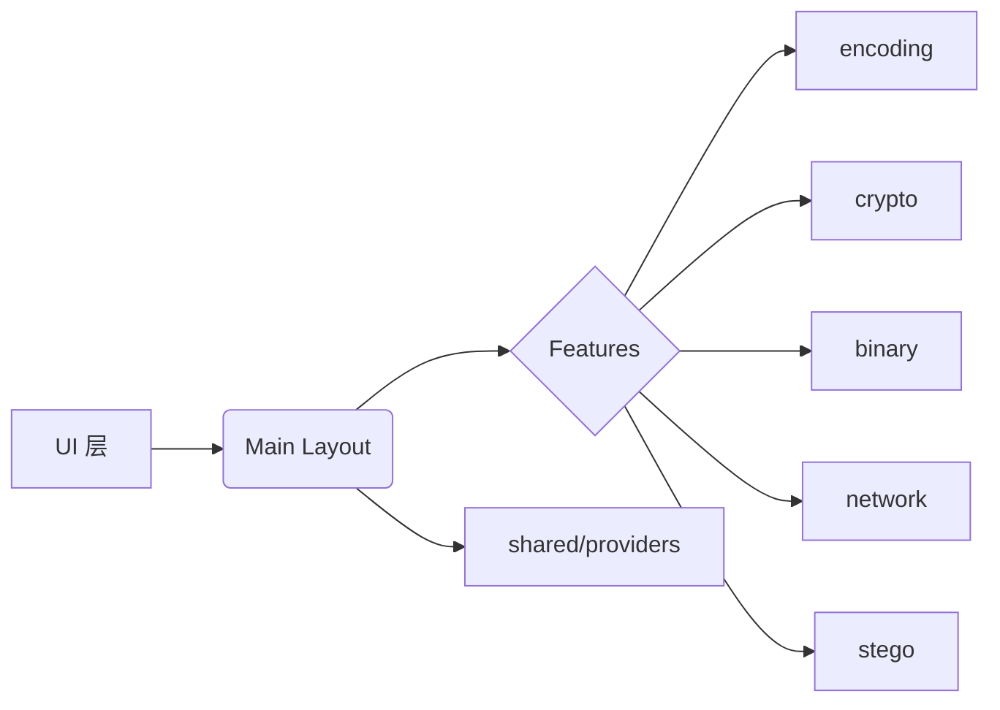

# ctf_tools


🎯   
📜     

✨ MapleLeaf 蜜汁 CTF 工具箱

一个用 Flutter 构建的跨平台 CTF 助手，集成常用编码/解码、二进制处理、密码学、网络查询与隐写工具，旨在帮助 Pwner/CTF 玩家快速验证样例与调试题目。🚀

---

## 亮点 ✨

- 🧩 多模块工具集合：`binary`、`crypto`、`encoding`、`network`、`stego`、`misc`
- 🚀 跨平台支持：通过 Flutter 一键运行到 Windows / Linux / macOS
- 🛠️ 模块化设计：易于扩展与集成新工具页面
- 🎨 可定制 UI：主题、图标与字体支持
- 📦 模块化结构：模块化设计，可扩展与集成新工具
---

## 快速导航 🔗

- 仓库根配置： [pubspec.yaml](pubspec.yaml)
- 源码入口与 UI： [lib](lib)
- 主要页面： [lib/main.dart](lib/main.dart)、[lib/main_layout.dart](lib/main_layout.dart)
- 网络工具页： [lib/features/network](lib/features/network)
- 许可文件： [LICENSE](LICENSE)

---

## 模块概览 📚

（基于 `lib` 目录整理）

- `features/encoding` — 文本与二进制编码/解码（BaseX / Text / Protobuf）🔤
- `features/crypto` — 密码学助手（哈希 / 常见加密算法工具）🔐
- `features/binary` — 二进制数据处理与分析工具（字节视图、转储）🔎
- `features/network` — 网络查询（DNS、WHOIS、Recon 页面）🌐
- `features/stego` — 隐写检测与提取（图片/声音占位扩展）🕵️‍♂️
- `features/misc` — 其它小工具与便捷脚本🧰

更多实现细节请查看 [lib](lib) 目录。

---

## 环境需求 🧭

- Flutter SDK（与 `pubspec.yaml` 中 `environment` 保持一致）
- 桌面构建依赖：
	- Windows: Visual Studio（含 Desktop development）
	- macOS: Xcode
	- Linux: clang / cmake / make

推荐 Dart SDK：`^3.10.8`（详见 `pubspec.yaml`）

---


## 本地运行（示例） ▶️

1) 安装依赖：

```bash
flutter pub get
```

1) 运行：

```bash
# 默认设备/模拟器
flutter run

# 指定平台（示例：Windows）
flutter run -d windows
```

1) 打包发布：

```bash
flutter build windows --release
```

---

## 贡献指南 🤝

欢迎贡献！建议流程：

1. Fork → 新分支（`feature/...` / `fix/...`）
2. 本地运行并添加测试（如适用）
3. 提交 PR：描述变更、截图与复现步骤

请遵守：`flutter_lints` 风格与清晰的提交信息。

---

## 资源 & 链接 🔗

- Flutter： https://flutter.dev
- Dart： https://dart.dev
- 依赖（示例）： `whois`、`dns_client`、`base_x`（详见 [pubspec.yaml](pubspec.yaml)）

---

## 架构概览 📐



---


## 许可证 ⚖️

本项目遵循 [LICENSE](LICENSE)。如需商业使用请在 Issues 中联系作者讨论。📬

---

## 联系与鸣谢 💬

如有建议或问题，请在 Issues 中提出。感谢所有开源依赖与贡献者。

_制作：MapleLeaf — 祝你打破题目！💥_


---

## 联系与鸣谢

如有建议或想法，欢迎在 Issues 中提出。感谢所有贡献者与灵感来源的开源库。
